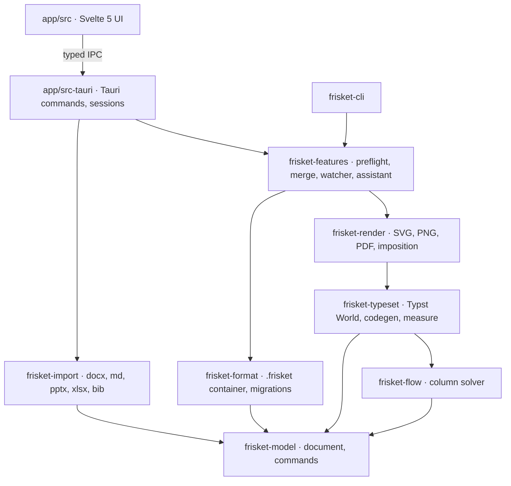

# Frisket — Specification & Implementation Plan

Sep 26, 2026 · @Marius A.

## 0. How to read these documents

This specification is one of four binding documents in `plans/`. When they disagree, the first in this list wins:

1. `Specification.md` (this file) — behaviour, architecture, stack, dependencies.
2. [File-format-contract.md](File-format-contract.md) — everything written to disk.
3. [THEMES.md](THEMES.md) — every colour, font, size, margin and spacing value.
4. [Working-plan.md](Working-plan.md) — task order, scope per task, files, steps, acceptance (with `TASKS.csv` generated from it).

The mockups in `ui/` show layout and wording; they rank below all four. Section numbers in this file are cited by the Working plan and must not be renumbered.

## 1. Overview

Frisket is a desktop publisher that lets scientists produce print-ready posters, flyers, booklets, handouts and certificates without design training. It is a new app: built on Tauri 2 with a Rust core, a Svelte 5 interface and the Typst typesetting engine as its layout and PDF engine. It targets macOS first (Apple Silicon, macOS 14+), keeps the code portable, and adds Windows and Linux after 1.0. The UI is English only.

**Licence.** Not decided yet: Frisket may ship as a paid, closed-source app or as open source. To keep both paths open, every code dependency must use a permissive licence (MIT, Apache-2.0, BSD, Zlib, ISC, CC0, Unicode) and every bundled font OFL 1.1 or Apache-2.0. No copyleft code (GPL, LGPL, AGPL, MPL) enters the build; the earlier AGPL citation component is gone. Bundled data under attribution licences (CSL styles CC BY-SA, icons CC BY) is allowed because it is data, not linked code, and is credited in the app.

**Name.** Frisket (final). A frisket is the hinged frame on a hand press that holds the sheet and masks the margins so only the intended area prints — a fit for an app built around structure, safe margins and preflight. It is short, unused by any known software product, and works as a file extension (`.frisket`).

**Positioning.** Not an InDesign clone. Frisket is structure-first: the user edits sections, figures and a theme, and the layout follows. Free-form frames exist as an escape hatch. Its distinctive promise is a live link to the analysis pipeline: figures exported from R refresh on the poster automatically, and a CLI rebuilds the PDF from a pipeline.

**Guiding principles**

- Structure over pixels: documents are outlines of typed blocks placed on a column grid.
- Good defaults, no dead ends: kind, size, layout and theme can change later and content re-flows.
- Explain, then fix: problems are described in plain language with a one-click, undoable fix.
- Screen equals print: one engine (Typst, driven from Rust) produces the canvas image, the PDF and the CLI output. The webview never lays out document content.
- Files are forever: a document saved by any released build opens in every later build ([File format contract](File-format-contract.md)).
- Local and open: one file per document in a documented format, no account, no telemetry.
- Scientific content is first-class: linked figures, tables, equations, citations and QR codes are native blocks.

**Concept interface.** Twelve mockup screens live in `ui/01-home.png` … `ui/12-booklet.png`; section 5 lists them. Where the mockups and the text disagree, section 5 says which wins.

## 2. Stack decision and feasibility

Tauri 2 is feasible for this app on one condition: document layout and PDF output happen in Rust, not in the webview. The webview draws the app chrome and interaction overlays only. With that split, the hard parts that stalled the AppKit attempt (text engine, PDF writer, math, citations) come from one mature, Apache-2.0 Rust engine — Typst — instead of being hand-built on TextKit and Core Graphics.

**Why not lay out in the webview.** The webview differs per platform (WKWebView on macOS, WebView2 on Windows, WebKitGTK on Linux), so HTML/CSS layout would not match between machines or between screen and PDF, and webviews offer no control over bleed, crop marks, font embedding or PDF boxes. "Screen equals print" is impossible that way.

**Why Typst as the engine.** Typst is a Rust typesetting system usable as a library. One compile produces laid-out pages that render to SVG (canvas), PNG (previews, PNG export) and PDF (print). It already provides what the spec needs: paragraph layout with hyphenation and justification, OpenType features, tables, native math, figures with numbering and cross-references, bibliographies from BibTeX/BibLaTeX with CSL styles, SVG and (since 0.14) PDF images placed as vectors, tagged PDF and PDF/A, and incremental recompilation. Frisket never stores Typst code: it keeps its own document model and generates Typst input at runtime, so an engine upgrade cannot break saved files.

**Stack at a glance**

| Concern | Choice | Notes |
| --- | --- | --- |
| App shell | Tauri 2 | Same as ClinSkimmer; one window, every document and Settings open as tabs |
| UI | Svelte 5 (runes), TypeScript strict, Vite, pnpm | Panels, dialogs, canvas viewer, overlays |
| Core logic | Rust workspace (`crates/`) | Model, format, layout, render, features — no UI code |
| Layout, text, math, citations | Typst crates, version pinned per release | Driven through a custom `World` |
| Canvas image | Typst → SVG per page, PNG tiles at high zoom | Overlays (selection, handles, badges) drawn in HTML/SVG above it |
| Text editing | ProseMirror overlay editor in the webview | Model updated per keystroke; Typst re-renders behind it |
| PDF | typst-pdf, then a small post-processor (lopdf) for TrimBox/BleedBox | Bleed and crop marks generated as page content |
| File format | ZIP container with JSON, versioned by the File format contract | Replaces the macOS-only package directory |
| Updates | tauri-plugin-updater (signed with minisign) | Works without notarization |
| CLI | Separate Rust binary sharing the core crates | For R pipelines |

**What changes compared with the old macOS-only design**

| Old mechanism | New mechanism | Consequence |
| --- | --- | --- |
| TextKit 1 threaded frames | Typst paragraph layout; stories flow across columns and pages natively | Free-frame to free-frame threading becomes a P0 spike; fallback is "continued" frames |
| Core Graphics renderer | Typst SVG / PNG / PDF output | Canvas and PDF share one layout by construction |
| NSDocument windows | One window with a tab strip; sheets inside the tab | Home, documents and Settings are tabs; dialogs never open new windows |
| SwiftMath | Typst math; LaTeX input converted with MiTeX | Users may type LaTeX or Typst math |
| citeproc-js in JavaScriptCore (AGPL) | Typst's built-in bibliography engine (hayagriva) | No AGPL component; CSL styles still supported |
| NSDocument autosave and versions | Own autosave, crash recovery and snapshot history | Specified in F1 and the File format contract |
| FSEvents | `notify` crate | Cross-platform watching |
| NSSpellChecker | Webview spell checking in the editor overlay | Uses the system dictionaries on macOS |
| Apple Foundation Models | Optional OpenAI-compatible local endpoint (Ollama, LM Studio) | Assistant stays optional and off by default |
| Sparkle | tauri-plugin-updater | Same EdDSA-style signed updates |
| Quick Look extension | `preview.png` inside the file; Quick Look plugin deferred | Finder shows a generic icon until then |

**Honest limits.** In-place text editing is the hardest part in any stack; here it is an overlay editor whose text is re-typeset by Typst, so while typing the overlay shows browser-rendered text and Typst's version appears on commit. Typst's crate API is pre-1.0 and changes between releases; the version is pinned and upgraded deliberately with golden-test review. Both are covered by P0 spikes.

## 3. Users and core workflows

The primary user is a researcher who writes and analyses, not a designer. The quality bar: a first-time user produces a printable A0 poster from an abstract and three R figures in under an hour.

| Persona | Typical output | What they need most |
| --- | --- | --- |
| Clinical researcher / biostatistician | Conference poster, e-poster | Linked R figures, tables, readable at distance, fast |
| PhD student | Poster, thesis-day flyer, lay summary | Templates, citations, equations, preflight guidance |
| Conference or department organiser | Programme booklet, badges, certificates | Multi-page flow, CSV data merge, page templates |
| Study team (sponsor/CRO) | Recruitment flyer, patient handout | Brand kit (logos, colours), plain-language layouts |

**Document kinds in v1**

| Kind | Pages | Default sizes | Structure preset |
| --- | --- | --- | --- |
| Conference poster | 1 | A0/A1 portrait or landscape, 48×36 in, custom | Header, IMRaD sections, Conclusions, References, Contact & QR |
| E-poster | 1 or a few | 16:9 (1920×1080 px, 3840×2160 px) | Same as poster, screen type scale |
| Flyer / leaflet | 1–2 | A4, A5, US Letter, DL tri-fold | Headline, hero image, body, call to action, logos |
| Handout / one-pager | 1–2 | A4, US Letter | Title, summary, key figure, contacts |
| Programme booklet | 4–64 | A5, A4, B5 | Cover, day dividers, sessions, speakers, sponsors |
| Certificate / badge | 1 per record | A4 landscape, badge 90×55 mm, 4×3 in | Merge fields from CSV |
| Blank (default) | any | A4 portrait; other sizes one click away | One Flow column, 15 mm margins, empty outline; Free frames can be added |

**Core workflows**

1. New document: on the Home board pick Blank A4 (selected by default) or a template card, or start from a file (abstract .docx/.md/.qmd, PowerPoint poster, spreadsheet list); Create, Return or double-click opens it in a new tab. Size, layout and theme can change at any time afterwards.
2. Fill content: type into sections, drop figures from a watched folder, paste tables, add equations and citations.
3. Iterate with the analysis: re-run R; linked figures refresh; captions and numbering stay in place.
4. Preflight: fix overflows, low-resolution images, small text and contrast issues.
5. Export: print PDF (bleed and crop marks when needed), screen PDF, PNG, A4 handout, or batch via CLI.

## 4. v1 feature specification

v1 keeps the full scope of 14 feature areas, F1–F14. Each bullet names the mechanism in the new stack where it matters. Section 12 lists what is deferred.

### F1. Documents, pages and templates

- Document kinds and structure presets from section 3; kind can change after creation (content re-maps to the new preset).
- Page sizes: ISO A/B, US sizes, poster sizes, 16:9 screen, custom in mm/in/pt/px.
- Bleed and slug per document; safe-area margins shown as guides.
- Facing pages and spreads for booklets.
- Home board (screen 01): Blank A4 card first and selected by default, then one card per kind; filters All, Posters, Print, Multi-page, From a list, My templates; recent files and search in the sidebar; "Other sizes" links for the selected card. Dropping a `.frisket`, `.docx` or `.pptx` on the window opens or imports it.
- Templates: 3 layouts × 6 themes per kind at launch, chosen after creation from the inspector; "Save as template" for user templates (templates are `.frisket` files in the app data folder).
- Autosave every 30 s and on window blur to the app data folder; crash recovery offered at next launch.
- Snapshot history: up to 50 snapshots per document kept in app data (not inside the file), browsable and restorable; "Revert to saved".

### F2. Structured layout (the core differentiator)

- Every page has a layout mode: Flow (default) or Free.
- Flow mode: a column grid (1–6 columns, gutter, margins). Blocks stack top-to-bottom within columns in outline order and can span 1..n columns. Placement is computed by Frisket's own Flow solver in Rust; block heights are measured by Typst at the block's width.
- Outline sidebar mirrors reading order; drag in the outline or on the canvas to reorder.
- Auto-arrange: rebalances blocks across columns to minimise empty space and overflow while keeping reading order.
- Column balancing and vertical justification (distribute spare space between sections).
- Reading-order indicators: optional numbered badges for readers.
- Free mode: absolute frames with snapping, smart guides, align and distribute, lock, group, z-order.
- A Free frame can be placed on a Flow page (callouts, arrows, badges).

### F3. Blocks (content types)

| Block | v1 behaviour |
| --- | --- |
| Title / header | Title, authors with affiliation superscripts, affiliations list, logos row |
| Text section | Heading + rich text; bullets, numbered lists, bold/italic/super/subscript |
| Figure | Linked or embedded PDF, SVG, PNG, JPEG, TIFF (converted to PNG on import), WebP; caption; auto-numbering; alt text |
| Table | Native table; import CSV, TSV, XLSX; paste from Excel/Numbers; header rows, zebra, decimal alignment |
| Equation | LaTeX or Typst math, rendered as vector; display or inline |
| Callout / key finding | Highlighted box, theme accent |
| References | Auto-generated bibliography from cited keys |
| QR code | URL, DOI, email or vCard; vector output |
| Logo strip | Brand-kit logos, auto-sized to equal visual weight |
| Shapes and connectors | Rectangle, ellipse, line, arrow, elbow connector |
| Flowchart (CONSORT/PRISMA) | Guided builder with boxes, counts and arrows |
| Icon | From the bundled scientific icon library |
| Merge field | `{{field}}` placeholders for data merge (F10) |

### F4. Text and typography

- Typst paragraph layout: OpenType features, ligatures, small caps, old-style or lining figures, variable fonts.
- Paragraph and character styles; theme-bound by default, overridable per style.
- Stories flow across the columns of a block and across pages in Document Flow (booklets); overset indicator and overflow warnings. Threading between arbitrary Free frames is decided by spike T0.11 (Spike D).
- Hyphenation and justification from Typst for its supported languages; keep-with-next, widow/orphan control.
- Spell check in the editor overlay via the webview (system dictionaries; any language installed on the system, set per document or per style).
- Find and replace across the document, including styles.
- Special characters palette for science: Greek, ±, ≤, ≥, µ, °, arrows, superscript numerals.
- Text fitting: shrink or grow a section's text within limits to fit its box (never below the preflight minimum).

### F5. Themes and brand kits

- Theme = palette (primary, onPrimary, accent, surface, tint, text, muted, rule), type pairing, type scale, spacing scale, figure palette. Six built-in themes (Clinical navy, Forest, Plum, Graphite, Coral, Ocean), four type pairings and every value are defined in [THEMES.md](THEMES.md).
- Type scale derives from document kind and viewing distance.
- Colour-blind-safe figure palettes (Okabe–Ito, viridis family) with preview.
- Five bundled font families, chosen to be metric-compatible with the fonts most Word and PowerPoint files arrive in, so imports keep their line breaks and documents lay out identically on every machine:

  | Family | Metric-compatible with | Licence |
  | --- | --- | --- |
  | Liberation Sans | Arial, Helvetica | SIL OFL 1.1 |
  | Liberation Serif | Times New Roman | SIL OFL 1.1 |
  | Carlito | Calibri | SIL OFL 1.1 |
  | Caladea | Cambria | Apache-2.0 |
  | Lora | — (headings and posters) | SIL OFL 1.1 |

  Each ships Regular, Italic, Bold and Bold Italic. Equations use Latin Modern Math (bundled; GUST Font License, redistributed unmodified), which matches LaTeX's default look for users coming from R Markdown and Quarto. Defaults for new documents: body Liberation Sans, headings Lora (changeable in Settings › Fonts).
- System fonts are offered below the built-in ones ("Fonts on this Mac", on by default, can be hidden); a document using one gets a preflight note offering the closest built-in family.
- Brand kit: institution logos, colours and fonts saved once and applied to any document.
- Export theme to R: writes a ggplot2 theme and palette file so figures match the document fonts and colours.

### F6. Figures, assets and the R link

- Watched folders: link a folder (e.g. `output/figures`); new or changed files update linked figures (`notify` crate, debounced 300 ms).
- Link manager: status per asset (in sync, modified, missing, low resolution, embedded), relink, embed, embed all, unlink, reveal in Finder.
- Automatic relink: when linked files are missing, Frisket searches the watched folders and folders near the document for files with the same name and SHA-256 and offers "Use the found files" (screen 11).
- Vector PDF and SVG figures placed natively by Typst, never rasterised.
- Fit modes: fit width, fill (crop), original size; crop and focal point.
- Captions with automatic figure and table numbering in reading order; cross-references that update.
- Icon library: curated subset of Servier Medical Art and Bioicons, searchable, with automatic attribution line.
- Photo tools: crop, rotate, brightness/contrast (non-destructive, applied by the `image` crate at render time).

### F7. Citations

- Import BibTeX and BibLaTeX natively; CSL-JSON converted on import; optional live link to a Zotero Better BibTeX export file.
- Cite with a picker by key or title; numeric or author-year.
- Styles: Vancouver, AMA, APA, Nature built in; user-added `.csl` files.
- References block regenerates on every change; optional "move references behind QR" for posters.

### F8. Preflight

- Distance preview: simulate reading at 0.5–4 m.
- Checks: overflow, text below minimum size for the viewing distance, low effective resolution, contrast, missing fonts, missing links, content in the bleed or trim danger zone, empty placeholders, figure and table numbering order.
- Colour-vision simulation: protanopia, deuteranopia, tritanopia views of the whole document.
- Conference rule presets: max size, required sections, required logos.
- Every issue has an explanation, a "Show me" action and, where possible, an undoable fix.

### F9. Export

- PDF for print: embedded and subset fonts, vector content, bleed and crop marks, sRGB output intent; optional PDF/A-2b.
- PDF for screen: downsampled images, small file size, clickable links and QR targets.
- PNG and JPEG at chosen DPI; e-poster PNG at exact pixel size.
- A4 handout: poster scaled onto A4 with legible margins, one click.
- Booklet imposition: saddle-stitch printer spreads for office printing.
- Data-merge export: one multi-page PDF or one file per record.

### F10. Multi-page and data merge

- Page templates (master pages): shared headers, footers, page numbers, backgrounds.
- Automatic page numbers, section markers, running headers.
- Table of contents generated from heading styles.
- CSV/XLSX data merge for certificates, badges and programme sessions (one row → one session block).

### F11. Import

- Abstract import: .docx, .md, .qmd; headings map to sections, images to figures, tables to tables.
- PowerPoint poster import (.pptx): text boxes, images, shapes and tables mapped to Free frames, with a "Convert to structured layout" assistant.
- Paste rich text (HTML from the clipboard) from Word, Pages and browsers with styles mapped to the theme.

### F12. Assistant (optional)

- Talks to a local OpenAI-compatible endpoint the user configures (Ollama, LM Studio); hidden when none is set. Nothing leaves the machine unless the user points it elsewhere.
- "Make it fit": proposes shorter versions of a section; accept or reject, never auto-applied.
- Draft alt text for figures from the caption.
- Split pasted abstract text into IMRaD sections.
- Never alters numbers, statistics or citations; changes shown as a diff before acceptance, and a check rejects any proposal whose numbers differ from the source.

### F13. Command-line tool

- `frisket` CLI shipped inside the app bundle (installable to `/usr/local/bin` from Settings): export to PDF/PNG, relink folders, run preflight with a JSON report, merge CSV, upgrade files to the current format.
- Lets an R pipeline (targets, Makefile, Quarto post-render) rebuild the PDF after figures change.

### F14. App experience

- English UI only; strings are kept in one module so a translation layer can be added later without touching components.
- One window with a tab strip: Home, each open document and Settings are tabs; `+` opens Home in a new tab. Export, file-version, crash-recovery and relink dialogs appear as sheets inside the current tab.
- Settings tab (screen 10) with sections: General (units, default page size, autosave, default theme and brand kit), Fonts, Figures and R (watched-folder defaults, theme export), Export defaults, Assistant (endpoint), Command line (install the CLI), Updates. No language section.
- Full keyboard shortcuts, screen-reader labels on every control, light and dark mode for the app chrome.
- Onboarding: first-run sample poster with inline tips.
- In-app updates via tauri-plugin-updater.

## 5. UI specification

The app is one window. A tab strip at the top holds Home, every open document and Settings; `+` opens a new Home tab. A document tab is a three-pane workspace (outline, canvas, inspector) with an Edit / Preflight mode switch. Export, file-version, crash-recovery and relink dialogs are sheets inside the current tab, never separate windows. All chrome is Svelte in the webview; the page image comes from Rust. The window uses Tauri's overlay title bar on macOS so it looks native (traffic lights inset into the tab strip).

### Window layout

| Region | Size | Contents |
| --- | --- | --- |
| Tab strip | full, 44 px | Home tab, document tabs (dot = unsaved, × = close), Settings tab, `+` |
| Toolbar | full, 52 px | Undo, redo; document name, kind, size, page count; insert tools (Select, Text, Figure, Table, Equation, Shape, QR/Icon grid, Favourites); Auto-arrange; Edit / Preflight switch; Preflight badge ("all clear" or "n issues"); Export |
| Left sidebar | 260 px, collapsible | Tabs: Structure (outline in reading order, status tags such as linked / low res / overflow, Add section), Pages (page templates, thumbnails, spreads), Assets (watched folders, linked files, icons, brand kit logos). A context card at the bottom (page summary or watched-folder status) |
| Canvas | flexible | Pages on a neutral pasteboard; zoom 10–800%; grid, guides, selection handles, overflow markers; zoom control in the bottom-right corner |
| Inspector | 300 px, collapsible | Context-sensitive tabs (below) |
| Status bar | full, 28 px | Page size, grid, zoom, context info (preflight counts, records, citations); save state and file format version on the right |

**Inspector tabs by context**

| Context | Tabs | Mockup |
| --- | --- | --- |
| Text selected or being edited | Text · Page · Theme | 02 |
| Block selected (figure, table, …) | Block · Page · Theme | 03 |
| Booklet / multi-page with styles in use | Text styles · Theme | 12 |
| References view | Style · Block | 08 |
| Data merge document | Data · Fields · Output | 07 |

Full-width views (Linked files 06, References 08, Theme 09) replace the canvas within the tab and have a "Back to page" button.

### Canvas composition (webview)

1. Pasteboard `div` with CSS transform for pan and zoom.
2. One layer per page: the Typst SVG for that page (below 200% zoom), or PNG tiles of 512 px rendered by Rust at the current zoom (at and above 200%, and for pages with heavy raster content).
3. Overlay layer in page coordinates: block outlines, selection handles, insertion marker, overflow and reading-order badges, guides. Positions come from the layout map (block id → page rectangles in pt) returned with every render.
4. Editor layer: the ProseMirror overlay, placed over the block being edited, using the theme's fonts and sizes.

### Canvas navigation

- ⌘ + scroll wheel, or trackpad pinch, zooms toward the mouse pointer (the point under the cursor stays fixed).
- Space + drag pans; plain scroll and two-finger swipe pan as usual.
- ⌘0 fits the page, ⌘1 shows 100%, ⌘+ / ⌘− step zoom.
- A zoom control in the bottom-right corner: −, slider, +, current zoom, "Fit page", "100%".
- The zoom level also shows in the status bar. A one-time hint bar explains the gestures on first use (02).
- Zoom and pan are CSS transforms; Rust re-renders only when zoom settles.

### Interaction model

- Plain language first: "1 column / 2 columns / Full", "Fit width", "Make room". Expert controls sit behind "Show details".
- Insert = drop onto the canvas or the outline; blocks snap into the nearest column slot with a live insertion marker.
- Drag files from Finder or a watched folder onto a figure placeholder to fill it (Tauri drag-drop events). An empty page invites dropping a figure, a .docx or a CSV anywhere on it.
- Double-click enters text editing; Escape leaves it; Tab moves to the next block in reading order.
- Every inspector change is one undo step; drags and typing coalesce (typing: one step per 1 s pause or word boundary).
- Context menus mirror inspector actions; command palette (⌘K) lists every action by name.
- Tabs: ⌘T new Home tab, ⌘W close tab (asks to save if dirty), ⌃Tab / ⌃⇧Tab cycle tabs, ⌘, opens the Settings tab.

### Screens

The mockups in `ui/` are the reference for layout and wording. Where a mockup and this text disagree, this text wins and the mockup is updated.

| # | File | Screen | Purpose | Key elements |
| --- | --- | --- | --- | --- |
| 01 | `ui/01-home.png` | Home | Start something new | Card board with Blank A4 default, kind cards, filters, recents and search, "Start from a file" (abstract, PowerPoint poster, spreadsheet list), selection bar with other sizes and Create |
| 02 | `ui/02-blank-a4.png` | Blank A4 with font menu | Empty document | Empty outline with Add text/figure/table, Title block being edited, font menu with built-in families and "Fonts on this Mac", zoom hints and control |
| 03 | `ui/03-poster-workspace.png` | Poster workspace | Edit | Outline with status tags, canvas with selected linked figure and overflow marker, watched-folder status, zoom control |
| 04 | `ui/04-preflight.png` | Preflight | Check before export | Colour-vision simulation, distance slider, issue cards with fixes, suggestion, passed checks |
| 05 | `ui/05-export.png` | Export (sheet) | Output | Presets (Print PDF, Screen PDF, PNG, A4 handout, Booklet print), options per preset, bleed preview and size estimate, file name and folder, equivalent CLI command, open preflight issues |
| 06 | `ui/06-assets.png` | Linked files | Manage linked files | Watched folders, library (linked files, icons, brand kit logos), table with status, last change and print quality, reveal, embed, relink, R hint for low resolution |
| 07 | `ui/07-data-merge.png` | Data merge | Records to pages | Record stepper with real data, data preview, field mapping, output (one PDF or one file per record), file-name pattern, overflow warnings per record |
| 08 | `ui/08-references.png` | References | Citations | Linked .bib library, search, cited / not-cited filter, style picker, live bibliography preview, `@` citation insert, move behind QR |
| 09 | `ui/09-theme.png` | Theme and brand kit | Look | Theme cards, palette with contrast check, type pairing, "Sizes set for" viewing distance, figure palette with CVD preview, brand kit, Export theme to R |
| 10 | `ui/10-settings.png` | Settings › Fonts | App-wide settings | Sections General, Fonts, Figures and R, Export defaults, Assistant, Command line, Updates; built-in font table, system-font toggle, default body and heading fonts |
| 11 | `ui/11-file-dialogs.png` | File version dialogs (sheets) | Compatibility and recovery | Older file (upgrade, backup kept), newer file (read-only), crash recovery (restore as tabs), linked figures moved (use found files) |
| 12 | `ui/12-booklet.png` | Booklet | Multi-page editing | Page templates, page thumbnails and spreads, story flowing across pages, text styles with usage counts |

### Visual language

- Chrome follows macOS conventions (system font, 13 px controls, sidebar materials approximated with neutral greys); accent is a fixed blue #0a5fc4 in v1.
- Document content never uses app chrome styling; the theme alone drives it.
- Warnings use orange with an icon and text, never colour alone; success uses green with a checkmark.

## 6. Architecture

Frisket is one repository with a Cargo workspace of UI-free core crates, a Tauri app that wraps them, and a CLI that reuses them. The Rust side owns the document; the Svelte side sends commands and draws what Rust returns. Everything except `app/` runs in tests and in the CLI unchanged.



Arrows point to dependencies. `frisket-model` depends only on serde, uuid and schemars. Only `frisket-typeset` and `frisket-render` depend on Typst crates.

### Crates and folders

| Unit | Responsibility |
| --- | --- |
| `crates/frisket-model` | Document types, typed IDs, units, theme tokens, `Command` enum with apply and invert, JSON Schema via schemars |
| `crates/frisket-format` | Read/write the `.frisket` ZIP, manifest, version checks, migration chain on `serde_json::Value`, unknown-field preservation, atomic save |
| `crates/frisket-flow` | Pure Flow solver: columns, spans, overflow, auto-arrange, balancing. No Typst dependency |
| `crates/frisket-typeset` | Typst `World` (bundled + system fonts, asset bytes, vendored packages), model → Typst content generation, block measurement, compile, layout map (block id → rects), incremental caching |
| `crates/frisket-render` | Page → SVG / PNG tile / PDF; crop marks, bleed, PDF box post-processing, A4 handout, booklet imposition, colour-vision simulation on PNG |
| `crates/frisket-import` | DOCX, MD/QMD, PPTX, CSV/TSV/XLSX, BibTeX/CSL-JSON, clipboard HTML → model commands |
| `crates/frisket-features` | Preflight rules, data merge, theme export to R, folder watching, assistant client |
| `crates/frisket-cli` | `frisket` binary (clap) |
| `app/src-tauri` | Tauri 2 shell: the single window, session registry (one session per open document tab), commands, events, menus acting on the active tab, updater, native file dialogs |
| `app/src` | Svelte 5 UI: tab strip and tab router (Home, document, Settings), panels, canvas viewer and overlays, ProseMirror editor, sheets |

### IPC contract

- Types crossing the bridge are Rust structs exported to TypeScript with `specta` + `tauri-specta`; the generated `app/src/lib/bindings.ts` is committed and CI fails if it is stale. Nobody hand-writes a TS type for a Rust struct.
- Commands (all `async`, all return `Result<T, AppError>`): `doc_new`, `doc_open`, `doc_save`, `doc_save_as`, `doc_close`, `doc_apply(doc, commands, coalesce_key?) → DocDelta`, `doc_undo`, `doc_redo`, `render_page(doc, page, format, zoom, rev) → RenderedPage`, `layout_map(doc, page, rev)`, `preflight_run(doc)`, `export(doc, preset, path)`, `assets_*`, `merge_*`, `settings_get/set`.
- Events (Rust → UI): `doc-changed {doc, rev, dirty_pages}`, `asset-changed {doc, asset, status}`, `preflight-updated {doc, summary}`, `autosaved {doc, at}`, `open-request {path}` (Finder open or drag onto the window; the UI opens or focuses a tab).
- Tabs are a UI concept: each document tab holds a `doc` handle, and every command and event carries it. Closing a tab calls `doc_close`. The Rust side keeps a registry of open sessions so opening a file already open focuses its tab instead of creating a second session.
- Every render request carries the model `rev`; the UI discards any result whose `rev` is older than what it already shows.
- Large binary results (PNG tiles) return as raw bytes through `tauri::ipc::Response`, never base64 in JSON.

### Key technical decisions

- **State ownership:** the Rust session holds the only authoritative document. The UI holds a read model (outline, selection, inspector values) rebuilt from `DocDelta`s. The UI never mutates document data locally except inside the editor overlay while typing.
- **Model and undo:** immutable structs with stable IDs (UUID v7); edits are `Command` values producing a new document plus an inverse. The undo stack lives in the session, per document.
- **Layout pipeline:** model → measure each Flow block with Typst at its column width (cached by content hash + width + theme hash) → Flow solver places blocks → page Typst content with absolutely placed blocks → compile → frames + layout map. Booklet pages in Document Flow let Typst paginate the story natively.
- **Typst integration:** Frisket generates Typst markup text per page from the model (easy to debug: the dev menu shows it) and compiles with a custom `World`. Typst packages are never downloaded at runtime; any needed package is vendored. The Typst version is pinned in `Cargo.toml` with `=` and recorded in each saved file's manifest for diagnostics only.
- **Fonts:** bundled OFL fonts are always available; system fonts are discovered once at start. A document stores font family names; a missing font triggers a preflight issue and a bundled fallback.
- **Concurrency:** one session per document behind a `tokio::sync::Mutex`; compile and render run on `spawn_blocking`; renders for stale revs are cancelled.
- **Linked files:** `notify` watcher per watched folder; asset identity = relative path from the document + SHA-256 of the last seen content.
- **Security:** Tauri capabilities restrict the webview to the app's commands; file access goes through Rust and dialogs, no `fs` plugin scope for arbitrary paths from the UI.

### Third-party dependencies

Licences are checked in CI by `cargo deny` (Rust) and `license-checker` (pnpm) against a permissive-only allowlist (MIT, Apache-2.0, BSD-2/3-Clause, ISC, Zlib, CC0-1.0, Unicode-3.0, MIT-0), so the product can later be released either closed-source or open-source (section 1). Copyleft licences (GPL, LGPL, AGPL, MPL, EPL) are denied. Adding anything not in this table needs an ADR.

| Library | Use | Licence |
| --- | --- | --- |
| tauri 2, tauri-plugin-updater, -dialog, -opener | App shell | MIT / Apache-2.0 |
| typst, typst-pdf, typst-svg, typst-render | Layout, math, bibliography, output | Apache-2.0 |
| mitex | LaTeX math → Typst math | Apache-2.0 |
| serde, serde\_json, uuid, schemars | Model and schema | MIT / Apache-2.0 |
| zip | `.frisket`, DOCX, PPTX, XLSX containers | MIT |
| quick-xml | DOCX, PPTX parsing | MIT |
| comrak | Markdown / QMD import | BSD-2-Clause |
| calamine | XLSX / CSV tables | MIT |
| lopdf | PDF box post-processing and checks | MIT |
| image | TIFF conversion, photo adjustments, CVD simulation | MIT / Apache-2.0 |
| qrcode | QR generation (SVG) | MIT / Apache-2.0 |
| notify | Folder watching | CC0-1.0 / MIT / Apache-2.0 (by version) |
| clap | CLI | MIT / Apache-2.0 |
| specta, tauri-specta | Typed IPC bindings | MIT |
| svelte 5, vite | UI | MIT |
| prosemirror-\* | Rich-text overlay editor | MIT |
| Bundled fonts (Liberation Sans, Liberation Serif, Carlito, Lora) | Text, headings | SIL OFL 1.1 |
| Bundled font Latin Modern Math | Equations | GUST Font License (unmodified) |
| Bundled font Caladea | Text (Cambria-compatible) | Apache-2.0 |
| CSL styles | Citation styles (data) | CC BY-SA 3.0, attributed |
| Servier Medical Art, Bioicons | Icon library (data) | CC BY 4.0 and per-icon licences, attributed |

## 7. Document model

A document is a tree of pages holding blocks in reading order, plus shared stories, styles, a theme and an asset table. Geometry is stored in points (1/72 in) as `f64`; the UI converts to mm, in or px. How this model is written to disk, versioned and migrated is binding and lives in [File-format-contract.md](File-format-contract.md); this section only names the entities.

| Entity | Key fields |
| --- | --- |
| Document | id, kind, theme, brandKit (embedded copy), styles, pageTemplates, pages, stories, assets, bibliography, mergeSource, preflightProfile |
| Page | id, size, bleed, templateRef, layoutMode (flow / documentFlow / free), grid (columns, gutter, margins), blocks |
| Block | id, type, content (per type), placement (flow: order, span / free: rect, rotation, z), styleOverrides, locked |
| Story | id, rich text as a ProseMirror-compatible node tree with style refs, citation and cross-reference nodes |
| Asset | id, kind (linked / embedded), relativePath, absolutePathHint, sha256, pixelSize, mediaType |
| Theme | palette, typePairing, typeScale, spacingScale, figurePalette, viewingDistance |
| Style | paragraph or character; font, size token, colour token, spacing, keep options, hyphenation |
| PageTemplate | id, name, background items, header/footer stories, page-number fields |
| Bibliography | source file ref, entries (as imported BibLaTeX text), style id, cited keys |

Rich text is stored as a small, Frisket-owned node schema (paragraph, heading, list, listItem, text with marks bold/italic/sup/sub/code/link, citation, crossRef, inlineMath, mergeField). The ProseMirror schema in the UI mirrors it one-to-one; a round-trip test guards the mapping.

## 8. Output, preflight and import

All output comes from the same Typst compile the canvas shows, so the PDF matches the screen. v1 output is RGB with an sRGB output intent; CMYK conversion and PDF/X are deferred.

### Export implementation

| Output | Mechanism | Notes |
| --- | --- | --- |
| Print PDF | typst-pdf; page generated at trim + bleed with crop marks drawn in the slug; lopdf sets TrimBox and BleedBox | Fonts embedded and subset by Typst; document title and author metadata set |
| Screen PDF | Same compile with images downsampled to a target ppi before compile | Links and QR targets become PDF link annotations |
| PNG / JPEG | typst-render at chosen DPI or exact pixel size | sRGB |
| A4 handout | Poster page placed scaled on an A4 page in a wrapper document | Warns if body text falls below 7 pt |
| Booklet imposition | Pages reordered into saddle-stitch spreads; count padded to a multiple of 4 | Duplex, short-edge flip note on the first sheet |
| Data merge | One compile per record, reusing measurement caches | Single PDF or one file per record; names from a field |

### Preflight engine

- Each check is a `PreflightRule` with id, severity (issue / suggestion), scope, a detector over the model plus layout map, and an optional fix returning `Command`s (fixes undo like any edit).
- Rules run after each relayout (debounced 250 ms) and feed the toolbar badge; the Preflight screen runs them all.
- Minimum text size is a function of viewing distance with a rule table per document kind; the rule and its table are in THEMES §3 (calibrated so that 1.5 m → 28 pt body).
- Distance preview: the page PNG is scaled to the visual angle of the chosen distance and blurred to typical acuity (CSS transform + filter in the webview).
- Colour-vision simulation: published CVD matrices applied in Rust to the page PNG (Machado et al. 2009 matrices).
- Effective resolution = pixel size ÷ placed size; 150 ppi warn, 100 ppi issue for print.
- Contrast: WCAG relative luminance on theme foreground and background tokens, plus text placed over images sampled from the PNG.
- Conference presets are JSON files (size limits, required sections, required elements) users can add and share; they carry their own `formatVersion` under the same contract.

### Import mapping

| Source | Mapped to |
| --- | --- |
| DOCX | Heading 1–2 → sections; paragraphs → text; inline images → figures; tables → tables; lists preserved |
| Markdown / QMD | `#`/`##` → sections; images → figures; pipe tables → tables; `$…$` math → equations; code chunks skipped; YAML title/author → header |
| PPTX (poster) | Each slide → page; text boxes, pictures, shapes, tables → Free frames at the same geometry; theme colours → palette |
| CSV / TSV / XLSX | Table block or data-merge source |
| BibTeX / BibLaTeX / CSL-JSON | Bibliography entries |
| Clipboard | HTML → styled text mapped to theme styles; images → figures; tab-separated text → table |

## 9. Non-functional targets and testing

Targets are measured on an M-series MacBook Pro with a reference A0 poster (12 sections, 6 vector figures, 2 tables, 30 references) and a 48-page booklet. Every target has a benchmark (`cargo bench` with criterion, or a Playwright timing test) that fails CI nightly on a >20% regression.

| Area | Target |
| --- | --- |
| Keystroke to character on screen (overlay editor) | < 16 ms |
| Typst re-render visible after a text edit, reference poster | < 150 ms |
| Relayout after a structural edit (move, resize, span change) | < 100 ms |
| Canvas pan and zoom | 60 fps (CSS transform; re-render only on zoom settle) |
| Linked figure refresh after file change | < 1 s |
| Open reference poster / booklet | < 1 s / < 2 s |
| Print PDF export, reference poster | < 3 s |
| Crash recovery | At most the last autosave interval (30 s) lost |
| File safety | No save can corrupt an existing file (atomic replace, validated) |
| Compatibility | Every file in the compatibility corpus opens in every later build (File format contract) |

### Testing strategy

| Suite | Tool | What it proves | CI |
| --- | --- | --- | --- |
| Model unit tests | `cargo test`, proptest | Commands apply and invert exactly; IDs stable | PR |
| Format round-trip | `cargo test` | Write → read → write is byte-identical | PR |
| Format compatibility corpus | `cargo test -p frisket-format --test compat` | Every historical fixture opens, migrates and renders | PR |
| Schema guard | `cargo run -p xtask -- schema-check` | Committed JSON Schema matches the code; minor bumps are additive only | PR |
| Flow solver golden tests | insta (JSON snapshots) | Known inputs give expected frames and overflow | PR |
| Typst codegen snapshots | insta | Generated Typst for fixtures is stable and reviewed | PR |
| Render snapshots | typst-render PNG vs reference, image-compare | Visual output within 0.5% pixels / 2/255 | PR |
| PDF checks | lopdf | Fonts embedded, boxes set, page count, links present | PR |
| Importer fixtures | `cargo test -p frisket-import` | Sample DOCX, MD, QMD, PPTX, XLSX, BibTeX map as specified | PR |
| Preflight rules | `cargo test -p frisket-features` | Each rule fires on its fixture, not on a clean one; fixes clear it | PR |
| CLI tests | assert\_cmd | Exit codes, report JSON schema, output files | PR |
| UI unit tests | Vitest + testing-library + jsdom | Components, stores, editor schema mapping | PR |
| UI flow tests | Playwright against the Vite build with mocked IPC (`@tauri-apps/api/mocks`) | New document → add figure → export dialog | PR |
| App smoke test | Scripted checklist on macOS (`docs/smoke.md`), run before each tag | Real window, real files, real PDF | Manual per release |
| Performance | criterion + Playwright timings | Targets above | Nightly |

Note: `tauri-driver` WebDriver testing does not support macOS, which is why UI flows are tested against the web build with mocked IPC and the real app gets a short scripted smoke test.

### Quality rules

- Every format change follows the File format contract checklist.
- Every bug fix adds a failing fixture or test first.
- `cargo clippy -D warnings`, `rustfmt`, `svelte-check`, ESLint and Prettier enforced in CI; `unsafe` forbidden in all crates (`#![forbid(unsafe_code)]`).

## 10. Implementation plan

v1 is built in 11 phases, P0–P10; each ends in a runnable build on Gitea. A usable poster tool exists after P6. The file format is frozen as format 1.0 at the end of P1, and from that moment every build must open every file any earlier build saved — there is no "pre-release" exemption. Size: S ≈ 1 unit, M ≈ 2, L ≈ 3–4.

| Phase | Delivers | Exit criterion | Size |
| --- | --- | --- | --- |
| P0 Foundations and spikes | Repo, workspace, single-window tabbed Tauri shell, CI, 6 spikes (A–F) | Blank A0 page renders from Typst in a document tab; CI green | M |
| P1 Model, format and canvas | Model, commands, undo, `.frisket` format 1.0, compat corpus, Free-mode canvas | Draw, move, undo, save, reopen identical; format 1.0 frozen | L |
| P2 Text and styles | Stories, overlay editor, styles, overset, spell check | Type a styled multi-column section; overset flagged | L |
| P3 Structure and themes | Flow solver, outline, block types, themes, templates, Home board | Poster created from the Home board, re-themed live | L |
| P4 Figures and the R link | Images, vector PDF/SVG, watched folders, link manager, captions, numbering, icons, brand kit | Re-running an R script updates the poster within 1 s | M |
| P5 Scientific content | Tables, equations, citations, QR, CONSORT/PRISMA, cross-references | Reference poster fully reproducible | L |
| P6 Export and CLI | Print/screen PDF, PNG, A4 handout, `frisket` CLI | Print-shop-ready PDF; CLI export from an R pipeline | M |
| P7 Preflight | Rule engine, all checks, distance and CVD preview, fixes, conference presets | Every rule has a fixture; fixes undo cleanly | M |
| P8 Multi-page and merge | Page templates, numbering, TOC, Document Flow, data merge, imposition | 48-page booklet and 200 certificates from CSV | L |
| P9 Import | DOCX, MD, QMD, clipboard, PPTX import with convert assistant | Sample PowerPoint poster imports and converts to Flow | M |
| P10 Assistant, polish, release | Assistant, accessibility, performance, onboarding, updater, licence decision applied | Section 9 targets met; 1.0 tagged | M |

**Critical path.** P0 → P1 → P2 → P3 is strictly sequential. After P3, P4 and P5 can interleave; P7 can start once P6's renderer is stable; P8 and P9 are independent.

### Release checkpoints

| Build | After | Audience |
| --- | --- | --- |
| 0.1 "Poster alpha" | P6 | You, a real conference poster |
| 0.5 "Beta" | P9 | Colleagues, internal Gitea release |
| 1.0 | P10 | Public release; channel and licence per the licence decision (section 1) |

The task-level breakdown, with files, steps and acceptance per task, is in [Working-plan.md](Working-plan.md).

## 11. Development workflow

The repository lives on the internal Gitea server (`git.twin-gray.ts.net`). All CI runs on one self-hosted runner: `act_runner` in host mode on the owner's Mac (label `macos-arm64`), so no GitHub Actions minutes are used. A Linux runner (Docker, `rust:1` image) can be added later for the core and UI jobs; the core is plain Rust and the UI plain web code, so nothing in the jobs is macOS-specific except the app bundle. Releases are ad-hoc signed and not notarized. The GitHub repository (`ma-brain/frisket`) is a mirror of Gitea; Gitea is the source of truth and runs CI.

### Repository layout

```text
frisket/
  Cargo.toml            workspace, pinned versions
  CLAUDE.md             entry point for implementing agents
  plans/                Specification, File-format-contract, THEMES, Working-plan, TASKS.csv
  ui/                   mockups 01–12
  crates/               frisket-model, -format, -flow, -typeset, -render, -import, -features, -cli
  app/
    src/                Svelte 5 UI
    src-tauri/          Tauri shell (tauri.conf.json, capabilities/)
  fixtures/
    compat/             one folder per released format version — never edited, never deleted
    figures/ import/ bib/ merge/ reference/ snapshots/
  schema/               frisket-1.0.schema.json, frisket-1.1.schema.json, ...
  fonts/                bundled fonts with licence files (THEMES §2)
  resources/            themes, rules, templates, CSL styles, icons, presets, samples
  spikes/               P0 spike programs, never imported by the app
  xtask/                repo automation (schema-check, bindings, fixtures)
  docs/                 adr/, format/, smoke.md
  .gitea/workflows/
```

- Trunk-based: `main` always builds; short-lived branches merged by pull request.
- ADRs for each spike outcome and every format change.
- Until the licence is decided, source files carry a copyright header without an SPDX licence tag and the repository has no LICENSE file (all rights reserved). `THIRD_PARTY.md` is generated by `cargo about` plus a hand-kept list for fonts, styles and icons from the first commit.
- Large binary fixtures in Git LFS.

### CI on Gitea Actions

| Job | Runner | Steps |
| --- | --- | --- |
| core | macOS host mode, label `macos-arm64` (later optionally Linux in Docker) | `cargo fmt --check`, `cargo clippy -D warnings`, `cargo test --workspace`, `cargo deny check`, `cargo xtask schema-check`, `cargo xtask bindings --check` |
| ui | macOS host mode, label `macos-arm64` | `pnpm install --frozen-lockfile`, `pnpm lint`, `pnpm check` (svelte-check), `pnpm test` (Vitest), `pnpm e2e` (Playwright, mocked IPC) |
| app | macOS (act\_runner in host mode on the Mac, label `macos-arm64`) | `pnpm tauri build --target aarch64-apple-darwin`; upload the `.dmg` as an artifact |
| nightly | macOS host mode | Benchmarks, full render snapshot set, release-configuration build |
| release (tag `v*`) | macOS | Build, ad-hoc sign, create the updater bundle and signature, publish a Gitea release with `.dmg`, `.app.tar.gz`, `.sig` and `latest.json` |

The runner is a LaunchAgent and does not read `~/.zshrc`: Rust and pnpm environment variables (e.g. `CARGO_TARGET_DIR` on an external disk) are set in the runner's `config.yaml` under `runner.envs` or in `~/.cargo/config.toml`. Scripts and workflows never assume the build output is in `./target`; they ask `cargo metadata` for `target_directory`.

Secrets: the updater private key (`TAURI_SIGNING_PRIVATE_KEY` and its password) in Gitea Actions secrets.

### Distribution without notarization

- `tauri.conf.json` → `bundle.macOS.signingIdentity: "-"` produces an ad-hoc signed `.app`; no Apple developer account needed.
- First launch is blocked by Gatekeeper; the user allows it in System Settings → Privacy & Security → Open Anyway. The README documents this with screenshots.
- The updater verifies each update with its minisign signature; the endpoint is the `latest.json` on the Gitea release while internal; the public channel is chosen with the licence decision. Whether updated builds need re-approval in Gatekeeper is checked in T10.7.
- Adding notarization later = Developer ID certificate + `APPLE_*` secrets in the release job. Nothing in the architecture blocks it.

### Later platforms

Windows and Linux need: a Windows runner (or GitHub Actions after going public), WebView2 bootstrapper in the installer, fonts and file-association checks, and running the smoke checklist. The core crates contain no macOS-specific code, so adding a Linux runner later keeps this cheap.

## 12. Risks, open questions and deferred items

The largest risk is still scope; the second is in-place text editing. The phase order yields a usable poster tool at 0.1 even if later phases slip, and the P0 spikes test the editing approach before any feature depends on it.

### Risks

| Risk | Impact | Mitigation |
| --- | --- | --- |
| Scope too large for v1 | Release slips | Ship 0.1 after P6; P8–P10 features can move to 1.x without breaking the format |
| Overlay editor feels different from final render | Users distrust WYSIWYG | Spike C (T0.10); theme fonts loaded in the webview; re-render within 150 ms; fallback: edit in the inspector with live canvas |
| Typst API churn between versions | Upgrade work, layout drift | Pin exact version; upgrade only in a dedicated task with snapshot review; files never store Typst code |
| Flow solver edge cases | Layout jumps | Golden tests from day one; deterministic ordering; Free mode as escape hatch |
| Free-frame threading not expressible in Typst | Booklet/flyer limitation | Spike D (T0.11); fallback "continued" frames that split at paragraph boundaries |
| Large posters slow as SVG in the webview | Laggy canvas | PNG tiles above 200% zoom; Spike B (T0.9) measures |
| Format change breaks old files | Lost trust, lost work | File format contract, compat corpus in CI, backups on upgrade |
| Hyphenation missing for a document language (e.g. Romanian content) | Ragged text in that language | Verify supported languages in Spike A (T0.8); fallback to no hyphenation with ragged-right default |
| Licence undecided | A copyleft dependency would close the commercial path | Permissive-only `cargo deny` allowlist from P0; decision recorded as an ADR before 0.5 |
| Paid app without notarization | Gatekeeper warnings deter paying customers | If commercial: Developer ID + notarization before 1.0 (release job already prepared for `APPLE_*` secrets) |
| Unnotarized builds deter users | Low adoption | Clear install docs; revisit notarization before 1.0 publicity |

### Open questions

- [ ] Licence model: paid closed-source or open source (GPL-3.0-or-later)? Decide before 0.5; until then the permissive-only rule in section 1 applies.
- [ ] Minimum text sizes: confirm THEMES §3 (1.5 m → 28 pt) with a printed A0 test before 1.0 and record it in an ADR.
- [ ] Which three conference poster presets to ship first?
- [ ] Icon library scope: how many icons to bundle versus download on demand? Only icons whose licence allows use in a closed app (CC0, CC BY) are eligible.

### Deferred to 1.x and later

| Item | Why deferred |
| --- | --- |
| Windows and Linux builds | macOS first; code stays portable and core tests already run on Linux |
| CMYK conversion, spot colours, PDF/X | Large prepress effort; RGB PDF is accepted by most poster printers |
| IDML import and export | Low value for the target persona |
| HTML / interactive e-poster export | Typst HTML export still maturing; PNG and screen PDF cover v1 |
| Footnotes, baseline grid, anchored objects in booklets | Polish beyond v1 needs |
| Quick Look preview plugin | Needs a native macOS extension outside Tauri |
| R package writing `.frisket` directly | The CLI covers pipeline automation in v1 |
| Real-time collaboration, iPad app | Not needed for a solo-author tool |
| UI translations | English only in v1; strings are kept in one module so a translation layer can be added |

### Sources

- [Typst 0.14 release: tagged PDF, PDF/A, PDF images](https://typst.app/blog/2025/typst-0.14/)
- [Typst 0.15 release: variable fonts, multiple bibliographies, combined PDF standards](https://typst.app/blog/2026/typst-0.15/)
- [Tauri 2 updater plugin](https://v2.tauri.app/plugin/updater/)
